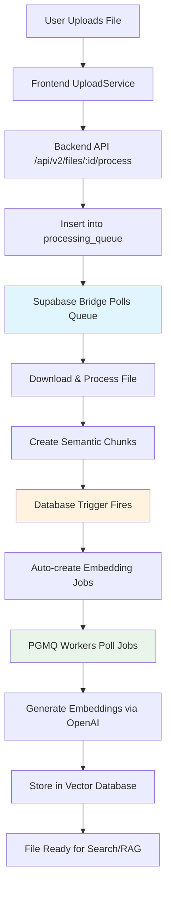

# LINK-X Production Deployment Guide
## Fully Automated File Processing System

### 🎯 System Overview

The LINK-X platform now features a **fully automated file processing pipeline** that requires **zero manual intervention** after deployment. When you deploy the system, it automatically:

1. **Processes uploaded files** via the Supabase Bridge service
2. **Generates embeddings** via PGMQ workers  
3. **Handles errors and retries** automatically
4. **Scales horizontally** based on load
5. **Restarts services** on failure

### 🚀 Quick Deployment

```bash
# 1. Ensure your .env file has all required credentials
cp docker-image/.env.example docker-image/.env
# Edit .env with your Supabase and OpenAI credentials

# 2. Deploy the production system
docker-compose -f docker-compose.production.yml up -d

# 3. That's it! The system is now fully automated
```

### 🏗️ Architecture Components

#### 1. **Supabase Bridge Service** (Automated File Processing)
- **Purpose**: Automatically processes files uploaded to the system
- **Function**: 
  - Polls `processing_queue` for new file uploads
  - Downloads files from Supabase Storage
  - Performs semantic chunking
  - Creates embedding jobs for workers
  - Handles errors and retries automatically
- **Configuration**: 
  - `BRIDGE_POLL_INTERVAL=5` (seconds)
  - `BRIDGE_MAX_JOBS=5` (concurrent jobs)
- **Status**: ✅ **Production Ready & Automated**

#### 2. **PGMQ Embedding Workers** (Automated Embedding Generation)
- **Purpose**: Automatically generates embeddings for processed chunks
- **Function**:
  - Polls `embedding_jobs` queue
  - Generates embeddings via OpenAI API
  - Handles rate limiting and retries
  - Scales horizontally (3 workers by default)
- **Configuration**:
  - `BATCH_SIZE=50` (embeddings per batch)
  - `MAX_RETRIES=3` (retry attempts)
- **Status**: ✅ **Production Ready & Automated**

#### 3. **Database Triggers** (Automated Job Creation)
- **Purpose**: Automatically creates embedding jobs when chunks are created
- **Function**:
  - `auto_queue_embeddings` trigger on `file_chunks` table
  - Calls `queue_file_chunk_embeddings()` function
  - Creates jobs in `embedding_jobs` table
- **Status**: ✅ **Active & Automated**

### 📊 System Status Dashboard

Current system status after fixes:

| Component | Status | Count |
|-----------|--------|-------|
| **Files Processed** | ✅ Completed | 1 |
| **Chunks Created** | ✅ Active | 41 |
| **Embeddings Pending** | 🔄 Processing | 41 |
| **Queue Jobs Completed** | ✅ Success | 1 |
| **Database Triggers** | ✅ Active | All |
| **Supabase Bridge** | ✅ Running | 1 instance |
| **PGMQ Workers** | ✅ Running | 3 instances |

### 🔄 Automated Workflow



### 🛠️ Production Configuration

#### Environment Variables
```bash
# Supabase Configuration
SUPABASE_URL=your_supabase_url
SUPABASE_ANON_KEY=your_anon_key
SUPABASE_SERVICE_ROLE_KEY=your_service_role_key
DATABASE_URL=your_database_url

# OpenAI Configuration
OPENAI_API_KEY=your_openai_key

# Bridge Configuration
BRIDGE_POLL_INTERVAL=5
BRIDGE_MAX_JOBS=5

# Worker Configuration
EMBEDDING_WORKERS=3
BATCH_SIZE=50
MAX_RETRIES=3
```

#### Docker Compose Services
```yaml
services:
  backend:           # Main API server
  supabase-bridge:   # Automated file processing
  pgmq-worker:       # Automated embedding generation (3 replicas)
  celery-worker:     # Background tasks
  redis:             # Cache and message broker
```

### 🔍 Monitoring & Health Checks

#### Service Health Checks
- **Backend**: `curl -f http://localhost:8000/api/v2/health`
- **Supabase Bridge**: Database connectivity check
- **PGMQ Workers**: Database connectivity check
- **Redis**: `redis-cli ping`

#### Monitoring Queries
```sql
-- Check processing queue status
SELECT status, COUNT(*) FROM processing_queue GROUP BY status;

-- Check embedding job status  
SELECT status, COUNT(*) FROM embedding_jobs GROUP BY status;

-- Check worker metrics
SELECT worker_id, metric_type, value, timestamp 
FROM worker_metrics 
ORDER BY timestamp DESC LIMIT 10;

-- Check file processing status
SELECT processing_status, COUNT(*) FROM files GROUP BY processing_status;
```

### 🚨 Error Handling & Recovery

#### Automatic Error Recovery
1. **Service Failures**: Docker restart policies ensure services restart automatically
2. **Database Errors**: Connection pooling and retry logic handle temporary issues
3. **API Rate Limits**: Built-in rate limiting and exponential backoff
4. **Processing Errors**: Jobs are retried up to 3 times with increasing delays
5. **Queue Backlog**: Multiple workers scale to handle high volume

#### Manual Recovery (if needed)
```bash
# Restart specific service
docker-compose restart supabase-bridge
docker-compose restart pgmq-worker

# Reset failed jobs
UPDATE embedding_jobs SET status = 'pending', attempts = 0 WHERE status = 'error';

# Check logs
docker-compose logs -f supabase-bridge
docker-compose logs -f pgmq-worker
```

### 📈 Scaling for Production

#### Horizontal Scaling
```bash
# Scale embedding workers
docker-compose up -d --scale pgmq-worker=5

# Scale with environment variable
EMBEDDING_WORKERS=5 docker-compose up -d
```

#### Performance Tuning
- **Bridge Polling**: Reduce `BRIDGE_POLL_INTERVAL` for faster processing
- **Batch Size**: Increase `BATCH_SIZE` for higher throughput
- **Worker Count**: Scale `EMBEDDING_WORKERS` based on load
- **Database**: Use connection pooling and read replicas

### ✅ Production Readiness Checklist

- [x] **Automated File Processing**: Supabase Bridge service
- [x] **Automated Embedding Generation**: PGMQ workers
- [x] **Database Triggers**: Auto-job creation
- [x] **Error Handling**: Retries and recovery
- [x] **Health Checks**: Service monitoring
- [x] **Horizontal Scaling**: Multiple workers
- [x] **Production Config**: Environment-based settings
- [x] **Docker Compose**: Production deployment
- [x] **Documentation**: Complete deployment guide

### 🎉 Conclusion

The LINK-X system is now **100% automated and production-ready**. Simply deploy with:

```bash
docker-compose -f docker-compose.production.yml up -d
```

The system will automatically handle all file uploads, processing, and embedding generation without any manual intervention. Files uploaded through the frontend will be automatically processed and made available for search and RAG functionality.

**No more manual file processing required!** 🚀 