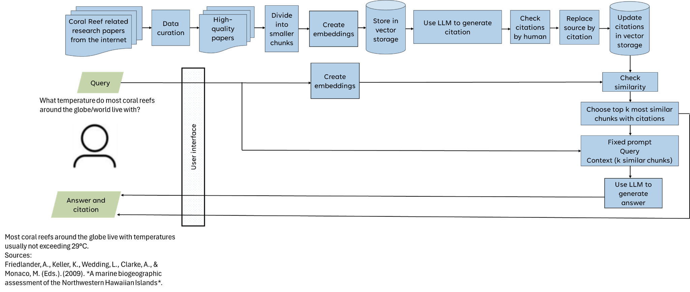

<p align="center">
  An Open-Source AI Chatbot Template Built With Next.js and the AI SDK by Vercel.
</p>

<p align="center">
  <a href="#model-providers"><strong>Model Providers</strong></a> ·
  <a href="#deploy-your-own"><strong>Deploy Your Own</strong></a>
  <a href="#features"><strong>Features</strong></a> ·
  <a href="#running-locally"><strong>Running locally</strong></a>
</p>
<br/>

## Model Providers

This template ships with OpenAI `gpt-4o` as the default.

### TO-DO

Add Coral AI custom RAG system to API routes in `app/xhat/api`

## Features

- [Next.js](https://nextjs.org) App Router
  - Advanced routing for seamless navigation and performance
  - React Server Components (RSCs) and Server Actions for server-side rendering and increased performance
- [AI SDK](https://sdk.vercel.ai/docs)
  - Unified API for generating text, structured objects, and tool calls with LLMs
  - Hooks for building dynamic chat and generative user interfaces
  - Supports OpenAI (default), Anthropic, Cohere, and other model providers
- [shadcn/ui](https://ui.shadcn.com)
  - Styling with [Tailwind CSS](https://tailwindcss.com)
  - Component primitives from [Radix UI](https://radix-ui.com) for accessibility and flexibility
- Data Persistence
  - [Vercel Postgres powered by Neon](https://vercel.com/storage/postgres) for saving chat history and user data
  - [Vercel Blob](https://vercel.com/storage/blob) for efficient file storage
- [NextAuth.js](https://github.com/nextauthjs/next-auth)
  - Simple and secure authentication

## Running locally

You will need to use the environment variables [defined in `.env.example`](.env.example) to run Next.js AI Chatbot. It's recommended you use [Vercel Environment Variables](https://vercel.com/docs/projects/environment-variables) for this, but a `.env` file is all that is necessary.

> Note: You should not commit your `.env` file or it will expose secrets that will allow others to control access to your various OpenAI and authentication provider accounts.

1. Install Vercel CLI: `npm i -g vercel`
### Before running frontend:
```bash
cd coralx-frontend

pnpm install
```

### To run frontend: 
```bash
cd <project root directory>

docker-compose up --build
```

The frontend should now be running on [localhost:3000](http://localhost:3000/).


### To run backend container:
```bash
cd <project root directory>

bash run_backend.sh
```

### To run open new shell in backend container (for testing FAISS):
```bash
docker exec -it backend /bin/bash
```
## FAISS database generation & RAG

You will need to run the docker container in detatched mode and open a new interactive shell (shown above)

From the shell, enter the src folder:

```bash
cd src
```

### 1. Generate FAISS database from desired PDF
```bash
bash run_faiss.sh learning_pdfs/<name_of_pdf>
docker exec -it <container_id_or_name> /bin/bash # Open an interactive shell (separate from main process)
```
- Creates an md5 hash to be used as the PDF's unique ID
- `item_01_database_creation_FAISS.py`
  - Loads specified PDF document
  - Splits text into manageable chunks
  - Creates FAISS vector embeddings using OpenAI
  - Saves files `index.faiss` and `index.pkl` to `/app/src/faiss_generated/<pdf_id>/faiss_index/` within the container
  
- `item_02_generate_citations_APA_FAISS.py` && `item_03_replace_source_by_citation.py`
  - Generates APA citations using LLM: GPT-4o-mini
  - Saves citations to `/app/src/faiss_generated/<pdf_id>/additional_files/citations.csv` within the container
  - Updates vector storage with proper citations

### 2. FAISS index retrieval and RAG
> Note: Step 1. should be complete for the desired pdf before Step 2.
```bash
# WIP
```

### 3. Launch the Web Interface for testing RAG
> Note: Step 1. should be complete for the desired pdf before Step 3.
```bash
bash run_streamlit_ui.sh faiss_generated/<pdf_id>
```
- The streamlit web interface should now be running on [localhost:8501](http://localhost:8501/).
- From here, you can:
  - Ask questions about the supplied content
  - Receive AI-generated answers
  - View source citations for all responses

# PYTHON/RAG NOTES: Coral Research Question-Answering System

A sophisticated document processing and retrieval system that leverages FAISS (Facebook AI Similarity Search) and OpenAI embeddings to create an interactive question-answering interface for coral research documents.

## Overview

This project implements a document processing pipeline that converts PDF documents into a searchable vector database, coupled with a user-friendly Streamlit interface for querying coral-related research information.

## System Architecture



The system consists of three main workflows:

### 1. Document Processing Pipeline
- **Data Collection & Processing** (`item_01_database_creation_FAISS.py`)
  - Loads coral reef research papers
  - Splits documents into smaller chunks
  - Creates embeddings using OpenAI's model: Ada-002
  - Stores vectors in FAISS database: FlatL2-index

- **Citation Management** (`item_02_generate_citations_APA_FAISS.py` & `item_03_replace_source_by_citation.py`)
  - Generates APA citations using LLM: GPT-4o-mini
  - Human verification of citations (Done manually)
  - Updates vector storage with proper citations

### 2. Query Processing Pipeline
- **Query Processing** (`item_04_retriever_FAISS.py`)
  - Processes user queries
  - Creates query embeddings: Ada-002
  - Checks similarity with stored vectors: Euclidean-distance
  - Selects top k most similar chunks
  - Generates context-aware prompts: GPT-4o-mini
  - Uses LLM to generate answers with citations: GPT-4o-mini

- **User Interface** (`item_05_streamlit_FAISS.py`)
  - Provides web interface for user interaction
  - Displays answers and citations
  - Handles user input and system responses

## File Structure and Relationships

### Input Files
Located in `data/learning_pdfs/`:
- Collection of PDF documents to test course creation with
- Used by `item_01_database_creation_FAISS.py` for initial database creation

### Generated Files (FIXME)
Located in `additional_files/`:

1. **citations.csv**
   - Generated by: `item_02_generate_citations_APA_FAISS.py`
   - Contains: PDF source paths and their corresponding APA citations
   - Format:
     ```
     Source,Reference
     path/to/pdf,APA formatted citation
     ```


### Vector Database (FIXME)
Located in `faiss_index/`:
- Generated by: `item_01_database_creation_FAISS.py`
- Modified by: `item_03_replace_source_by_citation.py`
- Used by: All retrieval and evaluation scripts
- Contains: FAISS vector database with document embeddings

## Project Structure (FIXME)
```
project/
├── scripts/
│   └── FAISS_scripts/
│       ├── item_01_database_creation_FAISS.py    # Initial document processing
│       ├── item_02_generate_citations_APA_FAISS.py # Citation generation
│       ├── item_03_replace_source_by_citation.py   # Citation integration
│       ├── item_04_retriever_FAISS.py             # Query processing
│       ├── item_05_streamlit_FAISS.py             # Web interface
│       ├── item_06_eval_01_save_response_and_context.py # Evaluation data collection
│       ├── item_07_eval_02_human_evaluation.py     # System evaluation
│       ├── item_08_eval_03_generate_questions_answers_from_chunk.py  
│       ├── item_09_eval_04_save_response_and_context_LLM.py
│       ├── item_10_eval_05_llm_evaluation.py
├── data/
│   └── nine_pdfs/            # Source PDF documents
├── faiss_index/             # FAISS vector database storage
├── additional_files/
│   ├── citations.csv        # Generated APA citations
│   ├── background.jpeg      # UI background image
│   ├── system_architecture.png # System architecture diagram
│   ├── Q&A-Human_generated.csv # Human-created test questions
│   ├── Q&A-human_generated_with_context.csv # System responses
│   ├── Q&A_result-human_generated.csv # Detailed evaluation results
│   ├── overall_result-human_generated.csv # Summary evaluation metrics
│   ├── Q&A-LLM_generated.csv # LLM-created test questions
│   ├── Q&A-LLM_generated_with_context.csv # System responses
│   ├── Q&A_result-LLM_generated.csv # Detailed evaluation results
│   ├── overall_result-LLM_generated.csv # Summary evaluation metrics
│   └── overall_result-LLM_generated_divided.csv # Summary evaluation metrics
└── README.md
```

## Prerequisites

- Python 3.10.11
- OpenAI API key
- Required Python packages:
  ```
  langchain
  faiss-cpu
  openai
  python-dotenv
  pandas
  streamlit
  PyPDF2
  ```

## Installation

1. Clone the repository
2. Install required packages:
   ```bash
   pip install -r requirements.txt
   ```
3. Create a `.env` file with your OpenAI API key:
   ```
   OPENAI_API_KEY=your_api_key_here
   ```

## Acknowledgments

- LangChain for the document processing framework
- OpenAI for embeddings and GPT-4
- Facebook Research for FAISS
- RAGAS for evaluation metrics
