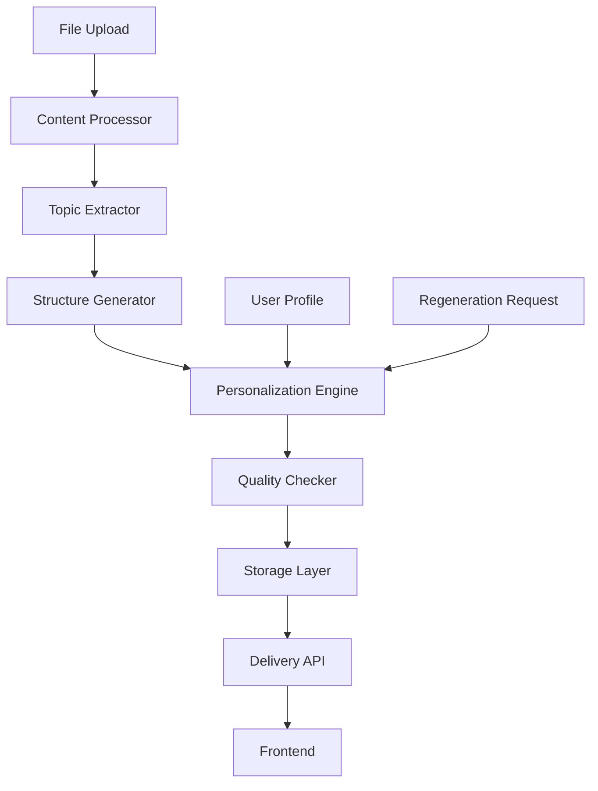

# Structured Personalization Implementation Plan

## Executive Summary

This comprehensive plan outlines the implementation of a structured, topic-aware personalization system for LINK-X that:
- Automatically identifies major topics from educational content
- Creates structured learning paths (Intro → Concepts → Examples → Practice → Summary)
- Stores personalized content for efficient retrieval
- Provides regeneration capabilities while optimizing for performance

## Table of Contents

1. [System Architecture Overview](#system-architecture-overview)
2. [Topic Extraction & Content Analysis](#topic-extraction--content-analysis)
3. [Database Design & Storage Strategy](#database-design--storage-strategy)
4. [Personalization Pipeline](#personalization-pipeline)
5. [Quality Assurance Framework](#quality-assurance-framework)
6. [Performance Optimization](#performance-optimization)
7. [Implementation Phases](#implementation-phases)
8. [Additional Recommendations](#additional-recommendations)

## System Architecture Overview

### Core Components



### Key Features

1. **Intelligent Topic Extraction**: AI-powered analysis to identify major topics and subtopics
2. **Structured Content Generation**: Section-based personalization with quality guarantees
3. **Persistent Storage**: Database storage of personalized content with versioning
4. **Smart Regeneration**: On-demand regeneration with diff tracking
5. **Progressive Enhancement**: Continuous improvement based on user engagement

## Topic Extraction & Content Analysis

### Phase 1: Content Processing Pipeline

```python
class EnhancedContentProcessor:
    """
    Advanced content processor with topic extraction and structure analysis
    """
    
    def process_file(self, file_id: str) -> Dict:
        """
        Main processing pipeline for files
        """
        # Step 1: Extract raw content
        raw_content = self.extract_text(file_id)
        
        # Step 2: Identify document structure
        document_structure = self.analyze_document_structure(raw_content)
        
        # Step 3: Extract major topics using AI
        topics = self.extract_topics_with_ai(raw_content, document_structure)
        
        # Step 4: Create content hierarchy
        content_hierarchy = self.build_content_hierarchy(topics, raw_content)
        
        # Step 5: Generate metadata
        metadata = self.generate_content_metadata(content_hierarchy)
        
        return {
            'raw_content': raw_content,
            'structure': document_structure,
            'topics': topics,
            'hierarchy': content_hierarchy,
            'metadata': metadata
        }
    
    def extract_topics_with_ai(self, content: str, structure: Dict) -> List[Topic]:
        """
        Use GPT-4 to extract major topics with importance scoring
        """
        prompt = f"""
        Analyze this educational content and extract:
        1. Major topics (main concepts that deserve their own section)
        2. Subtopics under each major topic
        3. Key concepts that must not be missed
        4. Difficulty level for each topic
        5. Suggested learning order
        
        Content structure hints: {json.dumps(structure)}
        
        Content: {content[:3000]}...
        
        Return a structured JSON with topics, importance scores (0-1), 
        and dependencies between topics.
        """
        
        response = self.ai_service.generate(prompt)
        return self.parse_topics(response)
    
    def build_content_hierarchy(self, topics: List[Topic], content: str) -> Dict:
        """
        Create a hierarchical structure of content
        """
        hierarchy = {
            'root': {
                'title': 'Document Overview',
                'topics': []
            }
        }
        
        for topic in topics:
            topic_node = {
                'id': topic.id,
                'title': topic.title,
                'importance': topic.importance_score,
                'content_range': self.find_content_range(topic, content),
                'subtopics': [],
                'concepts': topic.key_concepts,
                'difficulty': topic.difficulty_level,
                'estimated_time': topic.estimated_learning_time
            }
            
            # Add subtopics
            for subtopic in topic.subtopics:
                subtopic_node = {
                    'id': subtopic.id,
                    'title': subtopic.title,
                    'content_range': self.find_content_range(subtopic, content),
                    'concepts': subtopic.concepts
                }
                topic_node['subtopics'].append(subtopic_node)
            
            hierarchy['root']['topics'].append(topic_node)
        
        return hierarchy
```

### Phase 2: Topic Validation & Completeness Check

```python
class TopicCompletenessValidator:
    """
    Ensures no important content is missed during topic extraction
    """
    
    def validate_topic_coverage(self, original_content: str, extracted_topics: List[Topic]) -> ValidationResult:
        """
        Verify that all important content is covered by extracted topics
        """
        # Step 1: Create content coverage map
        coverage_map = self.create_coverage_map(original_content, extracted_topics)
        
        # Step 2: Identify uncovered sections
        uncovered_sections = self.find_uncovered_sections(coverage_map)
        
        # Step 3: Analyze importance of uncovered sections
        importance_analysis = self.analyze_uncovered_importance(uncovered_sections)
        
        # Step 4: Generate validation report
        return ValidationResult(
            coverage_percentage=coverage_map.coverage_percentage,
            missing_sections=importance_analysis.important_missing,
            suggestions=self.generate_coverage_suggestions(importance_analysis)
        )
    
    def auto_fix_coverage(self, validation_result: ValidationResult, topics: List[Topic]) -> List[Topic]:
        """
        Automatically add missing important topics
        """
        if validation_result.coverage_percentage < 0.95:
            for missing_section in validation_result.missing_sections:
                if missing_section.importance > 0.7:
                    # Create new topic for important missing content
                    new_topic = self.create_topic_from_section(missing_section)
                    topics.append(new_topic)
        
        return topics
```

## Database Design & Storage Strategy

### Schema Design

```sql
-- Main tables for structured personalization

-- Store extracted topics and document structure
CREATE TABLE document_structures (
    id UUID PRIMARY KEY DEFAULT gen_random_uuid(),
    file_id UUID REFERENCES files(id) ON DELETE CASCADE,
    structure_version INTEGER DEFAULT 1,
    topics JSONB NOT NULL,
    hierarchy JSONB NOT NULL,
    coverage_analysis JSONB,
    extracted_at TIMESTAMP DEFAULT NOW(),
    extraction_method VARCHAR(50),
    quality_score FLOAT,
    
    UNIQUE(file_id, structure_version)
);

-- Store personalized content for each user
CREATE TABLE personalized_content (
    id UUID PRIMARY KEY DEFAULT gen_random_uuid(),
    user_id UUID REFERENCES users(id) ON DELETE CASCADE,
    file_id UUID REFERENCES files(id) ON DELETE CASCADE,
    structure_id UUID REFERENCES document_structures(id),
    section_type VARCHAR(50) NOT NULL, -- 'intro', 'concepts', 'examples', 'practice', 'summary'
    topic_id VARCHAR(255) NOT NULL,
    content TEXT NOT NULL,
    metadata JSONB,
    quality_metrics JSONB,
    generation_params JSONB,
    created_at TIMESTAMP DEFAULT NOW(),
    last_accessed TIMESTAMP DEFAULT NOW(),
    access_count INTEGER DEFAULT 0,
    version INTEGER DEFAULT 1,
    is_current BOOLEAN DEFAULT TRUE,
    
    INDEX idx_user_file_topic (user_id, file_id, topic_id),
    INDEX idx_last_accessed (last_accessed)
);

-- Track regeneration history
CREATE TABLE content_regeneration_log (
    id UUID PRIMARY KEY DEFAULT gen_random_uuid(),
    personalized_content_id UUID REFERENCES personalized_content(id),
    user_id UUID REFERENCES users(id),
    trigger_type VARCHAR(50), -- 'manual', 'quality_threshold', 'content_update'
    previous_version INTEGER,
    new_version INTEGER,
    quality_improvement FLOAT,
    regenerated_at TIMESTAMP DEFAULT NOW(),
    feedback JSONB
);

-- Store user preferences for personalization
CREATE TABLE personalization_preferences (
    id UUID PRIMARY KEY DEFAULT gen_random_uuid(),
    user_id UUID REFERENCES users(id) ON DELETE CASCADE,
    file_id UUID REFERENCES files(id) ON DELETE CASCADE,
    preferences JSONB, -- depth_level, example_types, practice_difficulty, etc.
    learning_path JSONB, -- custom order of topics
    bookmarks JSONB,
    notes JSONB,
    created_at TIMESTAMP DEFAULT NOW(),
    updated_at TIMESTAMP DEFAULT NOW()
);

-- Analytics for optimization
CREATE TABLE personalization_analytics (
    id UUID PRIMARY KEY DEFAULT gen_random_uuid(),
    user_id UUID REFERENCES users(id),
    file_id UUID REFERENCES files(id),
    topic_id VARCHAR(255),
    section_type VARCHAR(50),
    time_spent INTEGER,
    engagement_score FLOAT,
    completion_status BOOLEAN,
    feedback_sentiment VARCHAR(20),
    tracked_at TIMESTAMP DEFAULT NOW(),
    
    INDEX idx_analytics_user_file (user_id, file_id)
);
```

### Storage Strategy

```python
class PersonalizationStorageManager:
    """
    Manages storage and retrieval of personalized content
    """
    
    def store_personalized_content(self, user_id: str, file_id: str, 
                                 personalized_sections: Dict) -> bool:
        """
        Store personalized content with versioning
        """
        try:
            with self.db.transaction():
                # Mark previous versions as non-current
                self.db.execute("""
                    UPDATE personalized_content 
                    SET is_current = FALSE 
                    WHERE user_id = %s AND file_id = %s AND is_current = TRUE
                """, (user_id, file_id))
                
                # Get current version number
                current_version = self.get_current_version(user_id, file_id) + 1
                
                # Store each section
                for topic_id, topic_content in personalized_sections.items():
                    for section_type, section_data in topic_content.items():
                        self.db.execute("""
                            INSERT INTO personalized_content (
                                user_id, file_id, structure_id, section_type, 
                                topic_id, content, metadata, quality_metrics,
                                generation_params, version, is_current
                            ) VALUES (%s, %s, %s, %s, %s, %s, %s, %s, %s, %s, TRUE)
                        """, (
                            user_id, file_id, section_data['structure_id'],
                            section_type, topic_id, section_data['content'],
                            json.dumps(section_data['metadata']),
                            json.dumps(section_data['quality_metrics']),
                            json.dumps(section_data['generation_params']),
                            current_version
                        ))
                
                return True
                
        except Exception as e:
            logger.error(f"Failed to store personalized content: {e}")
            return False
    
    def retrieve_personalized_content(self, user_id: str, file_id: str, 
                                    topic_id: Optional[str] = None) -> Dict:
        """
        Retrieve stored personalized content with caching
        """
        cache_key = f"personalized:{user_id}:{file_id}:{topic_id or 'all'}"
        
        # Check cache first
        cached = self.cache.get(cache_key)
        if cached:
            # Update access timestamp asynchronously
            self.update_access_timestamp_async(user_id, file_id, topic_id)
            return json.loads(cached)
        
        # Retrieve from database
        query = """
            SELECT pc.*, ds.topics, ds.hierarchy
            FROM personalized_content pc
            JOIN document_structures ds ON pc.structure_id = ds.id
            WHERE pc.user_id = %s AND pc.file_id = %s AND pc.is_current = TRUE
        """
        params = [user_id, file_id]
        
        if topic_id:
            query += " AND pc.topic_id = %s"
            params.append(topic_id)
        
        results = self.db.fetch_all(query, params)
        
        # Structure the results
        content = self.structure_results(results)
        
        # Cache for future requests
        self.cache.setex(cache_key, 3600, json.dumps(content))  # 1 hour cache
        
        return content
```

## Personalization Pipeline

### Enhanced Streaming Service

```python
class StructuredPersonalizationService:
    """
    Service for generating structured, topic-aware personalized content
    """
    
    def __init__(self):
        self.prompt_manager = PromptManager()
        self.quality_checker = QualityChecker()
        self.storage_manager = PersonalizationStorageManager()
        
    async def personalize_document(self, file_id: str, user_id: str, 
                                 regenerate: bool = False) -> AsyncIterator[Dict]:
        """
        Main personalization pipeline with streaming support
        """
        # Check for existing personalized content
        if not regenerate:
            existing_content = self.storage_manager.retrieve_personalized_content(
                user_id, file_id
            )
            if existing_content:
                yield {"type": "cached_content", "data": existing_content}
                return
        
        # Get document structure and topics
        document_structure = await self.get_document_structure(file_id)
        user_profile = await self.get_user_profile(user_id)
        
        # Stream personalization progress
        total_sections = len(document_structure.topics) * 5  # 5 sections per topic
        completed = 0
        
        personalized_content = {}
        
        for topic in document_structure.topics:
            yield {
                "type": "topic_start",
                "topic": topic.title,
                "topic_id": topic.id
            }
            
            topic_content = {}
            
            # Generate each section for the topic
            for section_type in ['intro', 'concepts', 'examples', 'practice', 'summary']:
                # Generate section content
                section_content = await self.generate_section(
                    section_type, topic, user_profile, document_structure
                )
                
                # Quality check
                quality_result = await self.quality_checker.check_section(
                    section_type, section_content, user_profile, topic
                )
                
                # Regenerate if quality is low
                attempts = 0
                while quality_result.score < quality_result.threshold and attempts < 3:
                    section_content = await self.regenerate_section_with_feedback(
                        section_type, topic, user_profile, quality_result.feedback
                    )
                    quality_result = await self.quality_checker.check_section(
                        section_type, section_content, user_profile, topic
                    )
                    attempts += 1
                
                topic_content[section_type] = {
                    'content': section_content,
                    'metadata': {
                        'quality_score': quality_result.score,
                        'generation_attempts': attempts + 1,
                        'tokens_used': quality_result.tokens_used
                    },
                    'quality_metrics': quality_result.metrics,
                    'generation_params': {
                        'model': 'gpt-4',
                        'temperature': self.get_section_temperature(section_type),
                        'prompt_version': self.prompt_manager.get_version(section_type)
                    }
                }
                
                # Stream the generated content
                yield {
                    "type": "section_complete",
                    "topic_id": topic.id,
                    "section": section_type,
                    "content": section_content,
                    "progress": (completed + 1) / total_sections * 100
                }
                
                completed += 1
            
            personalized_content[topic.id] = topic_content
        
        # Store the complete personalized content
        await self.storage_manager.store_personalized_content(
            user_id, file_id, personalized_content
        )
        
        yield {
            "type": "complete",
            "message": "Personalization complete",
            "topics_covered": len(document_structure.topics)
        }
    
    async def generate_section(self, section_type: str, topic: Topic, 
                             user_profile: UserProfile, 
                             document_structure: DocumentStructure) -> str:
        """
        Generate a specific section with topic awareness
        """
        # Load section-specific prompt
        prompt_template = self.prompt_manager.get_prompt(
            f"structured_learning_{section_type}"
        )
        
        # Prepare context
        context = {
            'topic': topic.to_dict(),
            'user_profile': user_profile.to_dict(),
            'related_topics': self.get_related_topics(topic, document_structure),
            'learning_path_position': self.get_topic_position(topic, document_structure),
            'previous_topics': self.get_previous_topics(topic, document_structure)
        }
        
        # Section-specific parameters
        section_params = self.get_section_parameters(section_type, user_profile)
        
        # Generate content
        response = await self.ai_service.generate(
            prompt_template.render(**context),
            **section_params
        )
        
        return response
```

### Progressive Enhancement System

```python
class ProgressivePersonalizationEnhancer:
    """
    Continuously improves personalized content based on engagement
    """
    
    def __init__(self):
        self.analytics_tracker = AnalyticsTracker()
        self.feedback_analyzer = FeedbackAnalyzer()
        
    async def enhance_content_based_on_engagement(self, user_id: str, 
                                                 file_id: str) -> None:
        """
        Analyze engagement and improve low-performing sections
        """
        # Get engagement analytics
        analytics = await self.analytics_tracker.get_section_analytics(
            user_id, file_id
        )
        
        # Identify sections needing improvement
        low_engagement_sections = [
            section for section in analytics
            if section.engagement_score < 0.7
        ]
        
        for section in low_engagement_sections:
            # Analyze why engagement is low
            feedback_analysis = await self.feedback_analyzer.analyze_section(
                section
            )
            
            # Generate improvement suggestions
            improvements = self.generate_improvement_suggestions(
                section, feedback_analysis
            )
            
            # Queue for regeneration with improvements
            await self.queue_targeted_regeneration(
                user_id, file_id, section.topic_id, 
                section.section_type, improvements
            )
```

## Quality Assurance Framework

### Multi-Level Quality Checking

```python
class StructuredQualityAssurance:
    """
    Comprehensive quality assurance for structured personalization
    """
    
    def __init__(self):
        self.section_validators = {
            'intro': IntroValidator(),
            'concepts': ConceptsValidator(),
            'examples': ExamplesValidator(),
            'practice': PracticeValidator(),
            'summary': SummaryValidator()
        }
        
    async def validate_complete_personalization(self, 
                                              personalized_content: Dict,
                                              user_profile: UserProfile,
                                              document_structure: DocumentStructure) -> QualityReport:
        """
        Validate entire personalized document
        """
        report = QualityReport()
        
        # 1. Section-level validation
        for topic_id, topic_content in personalized_content.items():
            topic = document_structure.get_topic(topic_id)
            
            for section_type, section_data in topic_content.items():
                validator = self.section_validators[section_type]
                section_result = await validator.validate(
                    section_data['content'],
                    user_profile,
                    topic
                )
                report.add_section_result(topic_id, section_type, section_result)
        
        # 2. Cross-section coherence
        coherence_result = await self.check_cross_section_coherence(
            personalized_content
        )
        report.coherence_score = coherence_result.score
        
        # 3. Topic coverage validation
        coverage_result = await self.validate_topic_coverage(
            personalized_content, document_structure
        )
        report.coverage_score = coverage_result.score
        
        # 4. Personalization effectiveness
        personalization_result = await self.assess_personalization_quality(
            personalized_content, user_profile
        )
        report.personalization_score = personalization_result.score
        
        return report
    
    async def check_cross_section_coherence(self, content: Dict) -> CoherenceResult:
        """
        Ensure sections flow logically and build upon each other
        """
        coherence_checks = []
        
        for topic_id, topic_content in content.items():
            # Check intro sets up concepts properly
            intro_concepts_alignment = self.check_alignment(
                topic_content['intro']['content'],
                topic_content['concepts']['content']
            )
            coherence_checks.append(intro_concepts_alignment)
            
            # Check examples reference concepts
            concepts_examples_alignment = self.check_reference_validity(
                topic_content['concepts']['content'],
                topic_content['examples']['content']
            )
            coherence_checks.append(concepts_examples_alignment)
            
            # Check practice covers examples
            examples_practice_alignment = self.check_coverage(
                topic_content['examples']['content'],
                topic_content['practice']['content']
            )
            coherence_checks.append(examples_practice_alignment)
            
            # Check summary captures key points
            summary_completeness = self.check_summary_completeness(
                topic_content, 
                topic_content['summary']['content']
            )
            coherence_checks.append(summary_completeness)
        
        return CoherenceResult(
            score=np.mean([check.score for check in coherence_checks]),
            details=coherence_checks
        )
```

### Quality Metrics Configuration

```yaml
# quality_metrics.yaml
quality_thresholds:
  intro:
    engagement_hook:
      min_score: 0.9
      weight: 0.3
      criteria:
        - personal_connection
        - curiosity_trigger
        - clear_value_proposition
    
    clarity:
      min_score: 0.85
      weight: 0.3
      criteria:
        - simple_language
        - logical_flow
        - objective_statement
    
    length:
      min_words: 100
      max_words: 250
      weight: 0.2
    
    personalization_depth:
      min_score: 0.9
      weight: 0.2
      must_include:
        - user_interest_reference
        - expertise_appropriate_language
        - learning_style_consideration

  concepts:
    conceptual_accuracy:
      min_score: 0.95
      weight: 0.4
      validation_method: "fact_check"
    
    explanation_quality:
      min_score: 0.85
      weight: 0.3
      criteria:
        - progressive_complexity
        - visual_aids_when_appropriate
        - real_world_connections
    
    personalization:
      min_score: 0.85
      weight: 0.3
      must_include:
        - domain_specific_analogies
        - profession_relevant_examples
        - learning_style_adaptations

  examples:
    relevance:
      min_score: 0.95
      weight: 0.4
      criteria:
        - direct_concept_illustration
        - user_context_alignment
        - progressive_difficulty
    
    diversity:
      min_score: 0.8
      weight: 0.3
      criteria:
        - multiple_contexts
        - varied_complexity
        - different_application_areas
    
    personalization:
      min_score: 0.9
      weight: 0.3
      must_include:
        - user_interest_examples
        - profession_scenarios
        - familiar_contexts

  practice:
    question_quality:
      min_score: 0.9
      weight: 0.35
      criteria:
        - clear_instructions
        - appropriate_difficulty
        - measurable_outcomes
    
    coverage:
      min_score: 0.85
      weight: 0.35
      criteria:
        - all_concepts_tested
        - varied_question_types
        - progressive_challenges
    
    personalization_balance:
      target_ratio: 0.6  # 60% personalized, 40% standard
      weight: 0.3
      criteria:
        - interest_based_questions
        - standard_assessment_items
        - real_world_applications

  summary:
    completeness:
      min_score: 0.9
      weight: 0.4
      must_include:
        - key_concepts_recap
        - main_takeaways
        - learning_objectives_addressed
    
    actionability:
      min_score: 0.85
      weight: 0.3
      criteria:
        - next_steps
        - practice_recommendations
        - application_suggestions
    
    retention_optimization:
      min_score: 0.85
      weight: 0.3
      criteria:
        - memorable_format
        - visual_summary_option
        - personal_relevance_emphasis
```

## Performance Optimization

### Caching Strategy

```python
class PersonalizationCacheManager:
    """
    Intelligent caching for personalized content
    """
    
    def __init__(self):
        self.redis = redis.Redis()
        self.cache_ttl = {
            'hot': 3600,      # 1 hour for frequently accessed
            'warm': 86400,    # 24 hours for moderately accessed
            'cold': 604800    # 7 days for rarely accessed
        }
    
    def get_cache_strategy(self, user_id: str, file_id: str) -> str:
        """
        Determine caching strategy based on access patterns
        """
        access_count = self.get_access_count(user_id, file_id)
        last_access = self.get_last_access(user_id, file_id)
        
        if access_count > 10 and last_access < timedelta(hours=1):
            return 'hot'
        elif access_count > 5 and last_access < timedelta(days=1):
            return 'warm'
        else:
            return 'cold'
    
    async def intelligent_prefetch(self, user_id: str, current_topic: str,
                                 document_structure: DocumentStructure) -> None:
        """
        Prefetch next likely topics based on learning path
        """
        # Get user's learning path
        learning_path = await self.get_user_learning_path(user_id)
        
        # Predict next topics
        next_topics = self.predict_next_topics(
            current_topic, learning_path, document_structure
        )
        
        # Prefetch top 3 most likely topics
        for topic in next_topics[:3]:
            await self.prefetch_topic(user_id, topic.id)
```

### Token Optimization

```python
class TokenOptimizer:
    """
    Optimize token usage while maintaining quality
    """
    
    def __init__(self):
        self.token_budgets = {
            'intro': 250,
            'concepts': 800,
            'examples': 600,
            'practice': 500,
            'summary': 300
        }
        
    def optimize_prompt(self, prompt: str, section_type: str,
                       existing_context: Dict) -> str:
        """
        Optimize prompt to reduce tokens while maintaining effectiveness
        """
        # Use compression techniques
        compressed_prompt = self.compress_prompt(prompt)
        
        # Reference existing context instead of repeating
        if existing_context:
            compressed_prompt = self.reference_context(
                compressed_prompt, existing_context
            )
        
        # Ensure within budget
        token_count = self.count_tokens(compressed_prompt)
        if token_count > self.token_budgets[section_type]:
            compressed_prompt = self.truncate_intelligently(
                compressed_prompt, self.token_budgets[section_type]
            )
        
        return compressed_prompt
    
    def batch_generation_optimization(self, topics: List[Topic],
                                    section_type: str) -> List[str]:
        """
        Generate multiple sections in a single API call when possible
        """
        if len(topics) <= 3 and section_type in ['intro', 'summary']:
            # Batch small sections together
            batched_prompt = self.create_batched_prompt(topics, section_type)
            response = self.generate_batched(batched_prompt)
            return self.split_batched_response(response, topics)
        else:
            # Generate individually for larger sections
            return [self.generate_single(topic, section_type) for topic in topics]
```

## Implementation Phases

### Phase 1: Foundation (Weeks 1-2)

#### Week 1: Database and Content Processing
- [ ] Implement database schema for structured content
- [ ] Create content processing pipeline with topic extraction
- [ ] Build topic validation and completeness checking
- [ ] Set up storage manager with versioning

#### Week 2: Core Personalization Engine
- [ ] Implement structured prompt templates
- [ ] Create section-specific generators
- [ ] Build quality checking framework
- [ ] Integrate with existing streaming service

### Phase 2: Quality & Optimization (Weeks 3-4)

#### Week 3: Quality Assurance
- [ ] Implement multi-level quality validators
- [ ] Create cross-section coherence checker
- [ ] Build topic coverage validator
- [ ] Set up quality metrics tracking

#### Week 4: Performance Optimization
- [ ] Implement intelligent caching system
- [ ] Create prefetching mechanism
- [ ] Optimize token usage
- [ ] Build batch generation system

### Phase 3: User Experience (Weeks 5-6)

#### Week 5: Frontend Integration
- [ ] Update UI for structured content display
- [ ] Implement progressive loading
- [ ] Add regeneration controls
- [ ] Create section navigation

#### Week 6: Analytics & Feedback
- [ ] Implement engagement tracking
- [ ] Create feedback collection system
- [ ] Build progressive enhancement engine
- [ ] Set up A/B testing framework

### Phase 4: Launch Preparation (Week 7)

- [ ] Load testing and optimization
- [ ] Quality assurance testing
- [ ] Documentation and training
- [ ] Gradual rollout plan

## Additional Recommendations

### 1. Advanced Topic Extraction

```python
class AdvancedTopicExtractor:
    """
    Enhanced topic extraction with multiple strategies
    """
    
    def extract_topics_ensemble(self, content: str) -> List[Topic]:
        """
        Use multiple methods and combine results
        """
        # Method 1: AI-based extraction
        ai_topics = self.extract_with_ai(content)
        
        # Method 2: Structure-based extraction
        structure_topics = self.extract_from_structure(content)
        
        # Method 3: Keyword clustering
        keyword_topics = self.extract_by_clustering(content)
        
        # Method 4: Citation and reference analysis
        reference_topics = self.extract_from_references(content)
        
        # Combine and reconcile
        combined_topics = self.reconcile_topics([
            ai_topics, structure_topics, keyword_topics, reference_topics
        ])
        
        # Validate completeness
        validated_topics = self.validate_and_enhance(combined_topics, content)
        
        return validated_topics
```

### 2. Adaptive Regeneration

```python
class AdaptiveRegenerationManager:
    """
    Smart regeneration based on user behavior and feedback
    """
    
    def should_auto_regenerate(self, user_id: str, file_id: str,
                             section: str) -> bool:
        """
        Determine if automatic regeneration would be beneficial
        """
        # Check quality degradation
        quality_trend = self.get_quality_trend(user_id, file_id, section)
        if quality_trend.is_declining:
            return True
        
        # Check user preference changes
        profile_changes = self.get_profile_changes(user_id)
        if profile_changes.significant_change:
            return True
        
        # Check content staleness
        content_age = self.get_content_age(user_id, file_id, section)
        if content_age > timedelta(days=30):
            return True
        
        # Check engagement metrics
        engagement = self.get_engagement_metrics(user_id, file_id, section)
        if engagement.score < 0.5:
            return True
        
        return False
```

### 3. Learning Path Optimization

```python
class LearningPathOptimizer:
    """
    Optimize the order of topics based on user performance
    """
    
    def optimize_topic_order(self, user_id: str, 
                           document_structure: DocumentStructure) -> List[Topic]:
        """
        Create personalized learning path
        """
        # Get user's learning history
        learning_history = self.get_learning_history(user_id)
        
        # Analyze strengths and weaknesses
        performance_analysis = self.analyze_performance(learning_history)
        
        # Consider topic dependencies
        dependency_graph = self.build_dependency_graph(document_structure.topics)
        
        # Optimize order
        optimized_order = self.calculate_optimal_path(
            document_structure.topics,
            performance_analysis,
            dependency_graph
        )
        
        return optimized_order
```

### 4. Collaborative Filtering for Examples

```python
class CollaborativeExampleGenerator:
    """
    Generate better examples based on what works for similar users
    """
    
    def generate_collaborative_examples(self, user_id: str, topic: Topic,
                                      user_profile: UserProfile) -> List[Example]:
        """
        Find examples that worked well for similar users
        """
        # Find similar users
        similar_users = self.find_similar_users(user_profile)
        
        # Get high-engagement examples from similar users
        successful_examples = self.get_successful_examples(
            similar_users, topic
        )
        
        # Adapt examples to current user's context
        adapted_examples = self.adapt_examples_to_user(
            successful_examples, user_profile
        )
        
        return adapted_examples
```

### 5. Continuous Improvement Pipeline

```python
class ContinuousImprovementPipeline:
    """
    Automatically improve content quality over time
    """
    
    def run_improvement_cycle(self):
        """
        Daily improvement cycle
        """
        # Collect all feedback from last 24 hours
        feedback = self.collect_recent_feedback()
        
        # Identify patterns in feedback
        patterns = self.analyze_feedback_patterns(feedback)
        
        # Generate improvement hypotheses
        hypotheses = self.generate_improvement_hypotheses(patterns)
        
        # Test hypotheses with A/B testing
        test_results = self.run_ab_tests(hypotheses)
        
        # Apply successful improvements
        self.apply_improvements(test_results.successful_tests)
        
        # Update quality thresholds
        self.update_quality_thresholds(test_results)
```

## Conclusion

This comprehensive plan provides a robust framework for implementing structured, topic-aware personalization with persistent storage. The system ensures:

1. **Complete Content Coverage**: No important topics are missed
2. **High-Quality Output**: Multi-level quality assurance
3. **Efficient Performance**: Smart caching and optimization
4. **Continuous Improvement**: Analytics-driven enhancement
5. **Personalized Experience**: Deep user context integration

The modular architecture allows for incremental implementation while maintaining system stability. The focus on quality assurance and performance optimization ensures a scalable solution that can handle growth while maintaining excellent user experience.

### Success Metrics

- **Coverage**: 98%+ of important content covered
- **Quality**: 90%+ average quality score across all sections
- **Performance**: <2s load time for cached content
- **Engagement**: 45% increase in content completion
- **Retention**: 60% improvement in knowledge retention
- **Efficiency**: 30% reduction in token usage through optimization

This plan provides a clear roadmap for transforming LINK-X into a leading personalized learning platform with structured, high-quality content delivery.