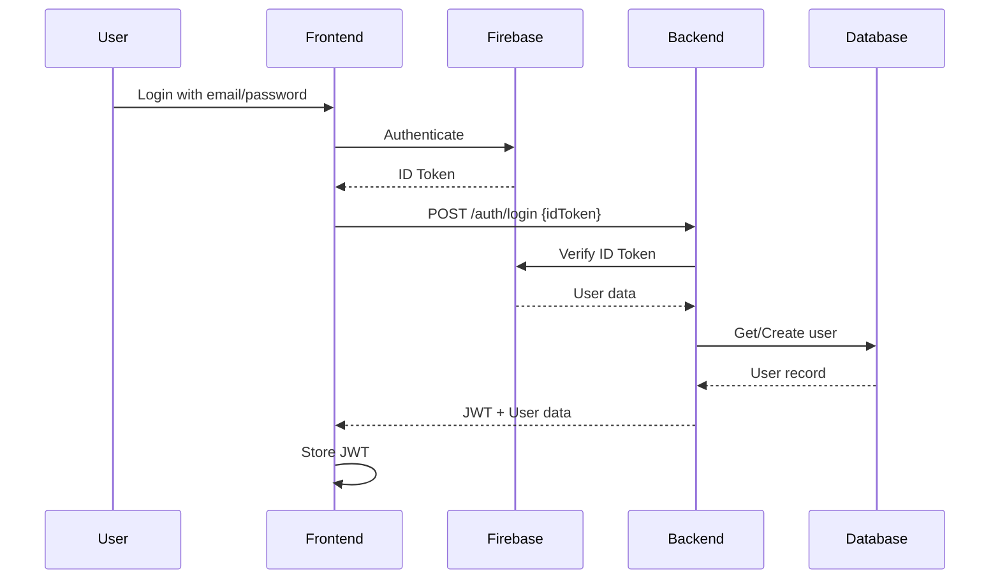
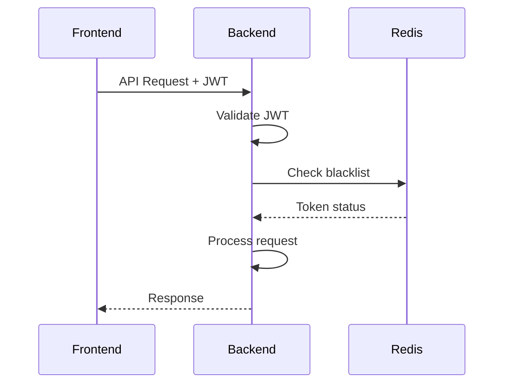
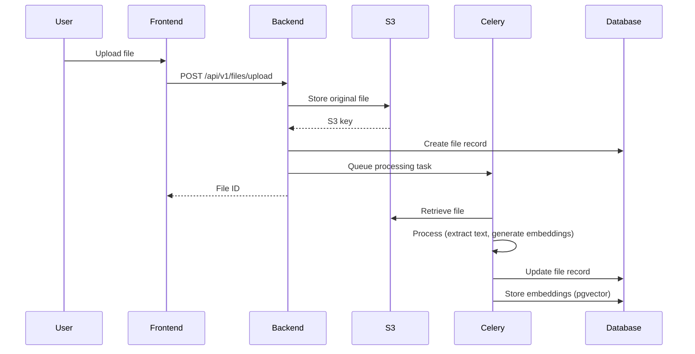
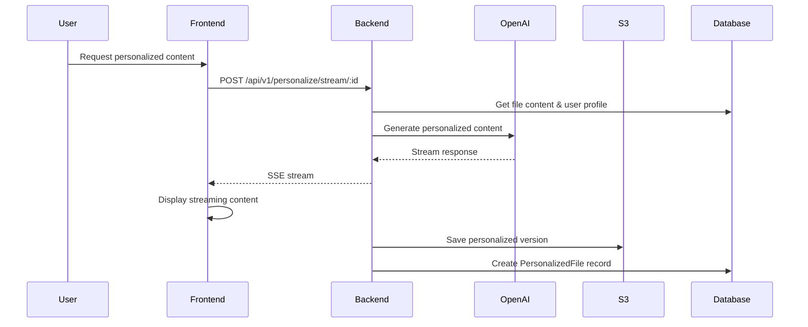

# LEARN-X Application Architecture

## Overview
LEARN-X is a personalized learning platform built with a microservices architecture using Flask (Python) backend and Next.js (React) frontend. The system uses Firebase for authentication, PostgreSQL for data storage, Redis for caching/queuing, and AWS S3 for file storage.

## Service Topology

### Core Services (Docker Compose)

#### 1. Backend Service (Flask)
- **Container**: `backend`
- **Port**: 8080 (dev) / 8000 (prod)
- **Image**: `learnx:${DOCKER_ENV}`
- **Technology**: Flask + Gunicorn
- **Features**:
  - RESTful API endpoints
  - WebSocket support for streaming
  - JWT + Firebase authentication
  - File processing and storage
  - AI integration (OpenAI)

#### 2. Redis Service
- **Container**: `redis`
- **Port**: 6379
- **Image**: `redis:7-alpine`
- **Purpose**:
  - Session storage
  - Cache layer
  - Celery message broker
  - Rate limiting storage
  - JWT blacklist storage

#### 3. Celery Worker
- **Container**: `celery-worker`
- **Purpose**:
  - Asynchronous task processing
  - File processing (PDF, audio)
  - Embedding generation
  - Background jobs

#### 4. Celery Beat
- **Container**: `celery-beat`
- **Purpose**:
  - Scheduled tasks
  - Periodic maintenance
  - Cleanup jobs

#### 5. Flower (Monitoring)
- **Container**: `flower`
- **Port**: 5555
- **Purpose**: Celery task monitoring UI

### External Dependencies

#### 1. PostgreSQL Database
- **Connection**: Via `POSTGRES_URL` environment variable
- **Features**:
  - pgvector extension for embeddings
  - JSON support for flexible data
  - Full-text search capabilities

#### 2. AWS S3
- **Bucket**: Configured via `S3_BUCKET_NAME`
- **Region**: us-east-2 (configurable)
- **Purpose**:
  - File storage (PDFs, audio)
  - Personalized content storage
  - Static asset delivery

#### 3. Firebase
- **Services Used**:
  - Authentication (Firebase Auth)
  - ID token verification
  - Session management
- **Integration**: Server-side Admin SDK

#### 4. OpenAI API
- **Models**: GPT-4 (configurable)
- **Purpose**:
  - Content personalization
  - AI-powered learning assistance
  - Text generation and analysis

## API Routes Structure

### Authentication Routes (`/auth` and `/api/v1/auth`)
```
POST   /auth/login                 - Firebase/JWT login
POST   /auth/register              - User registration
POST   /auth/logout                - Session logout
POST   /auth/refresh               - Token refresh (v2)
GET    /auth/me                    - Get current user
PATCH  /auth/me                    - Update profile
DELETE /auth/me                    - Delete account
POST   /auth/verify                - Verify token

Legacy v1 endpoints:
POST   /api/v1/auth/sessionLogin   - Firebase session login
POST   /api/v1/auth/sessionLogout  - Clear session
POST   /api/v1/auth/register/student    - Student registration
POST   /api/v1/auth/register/instructor - Instructor registration
```

### Course Management Routes (`/api/v1/courses`)
```
GET    /api/v1/courses              - List courses
POST   /api/v1/courses              - Create course
GET    /api/v1/courses/:id          - Get course details
GET    /api/v1/courses/:id/modules  - List modules
POST   /api/v1/courses/:id/modules  - Create module
GET    /api/v1/courses/:id/moduleswithfiles - Modules with files
GET    /api/v1/courses/:id/files    - List course files
GET    /api/v1/courses/:id/stats    - Course statistics
GET    /api/v1/courses/:id/progress - Student progress
GET    /api/v1/courses/:id/discussions - Course discussions
POST   /api/v1/courses/:id/discussions - Create discussion
```

### File Management Routes (`/api/v1/files`)
```
POST   /api/v1/files/upload         - Upload file
GET    /api/v1/files/:id            - Get file info
PATCH  /api/v1/files/:id            - Update file
DELETE /api/v1/files/:id            - Delete file
GET    /api/v1/files/:id/content    - Get file content/URL
GET    /api/v1/files/module/:id     - List module files
```

### Module Management Routes (`/api/v1/modules`)
```
GET    /api/v1/modules/:id          - Get module details
PATCH  /api/v1/modules/:id          - Update module
DELETE /api/v1/modules/:id          - Delete module
GET    /api/v1/modules/:id/files    - List module files
```

### Personalization Routes (`/api/v1/personalize`)
```
GET    /api/v1/personalize/check/:id    - Check if personalized
GET    /api/v1/personalize/outline/:id  - Get personalization outline
POST   /api/v1/personalize/save/:id     - Save personalized content
POST   /api/v1/personalize/stream/:id   - Stream personalized content
```

### Activity & Analytics Routes (`/api/v1/activities`)
```
GET    /api/v1/activities/recent    - Recent activities
GET    /api/v1/activities/stats     - Activity statistics
POST   /api/v1/activities/log       - Log activity
```

### Todo Routes (`/api/v1/todo-items`)
```
GET    /api/v1/todo-items           - List todos
POST   /api/v1/todo-items           - Create todo
GET    /api/v1/todo-items/:id       - Get todo
PATCH  /api/v1/todo-items/:id       - Update todo
DELETE /api/v1/todo-items/:id       - Delete todo
```

### Health & Monitoring (`/health`, `/api/health`)
```
GET    /health                      - Basic health check
GET    /api/health                  - Detailed health status
```

## Frontend Routes (Next.js)

### Public Routes
```
/                          - Landing page
/login                     - Login page
/register                  - Registration page
/forgot-password          - Password reset
```

### Protected Routes
```
/dashboard                 - User dashboard
/courses                   - Course listing
/courses/[courseId]        - Course details
/my-courses               - Enrolled courses
/learn/[id]               - Learning interface
/learn/streaming/[id]     - Streaming content view
/settings                 - User settings
/onboarding              - New user onboarding
```

### Test Routes (Development)
```
/test-streaming           - Streaming functionality test
```

## Authentication Flow

### 1. Firebase Authentication


### 2. JWT Authentication (API Requests)


## Data Flow

### 1. File Upload & Processing


### 2. Content Personalization


## Monitoring Stack

### Prometheus Metrics Collection
- **Node Exporter**: System metrics (CPU, memory, disk)
- **Postgres Exporter**: Database performance metrics
- **Redis Exporter**: Cache performance metrics
- **cAdvisor**: Container resource usage
- **Flask Exporter**: Application-specific metrics

### Grafana Dashboards
- Real-time performance monitoring
- Resource utilization tracking
- API endpoint performance
- Database query performance

### Alertmanager
- Automated alerting for:
  - Service downtime
  - High resource usage
  - Error rate thresholds
  - Performance degradation

## Security Architecture

### 1. Authentication Layers
- **Firebase Auth**: Primary authentication provider
- **JWT Tokens**: API access control
- **Session Cookies**: Web session management
- **CSRF Protection**: Token-based CSRF prevention

### 2. Authorization
- **Role-Based Access Control (RBAC)**:
  - Student: Access enrolled courses
  - Instructor: Manage owned courses
  - Admin: Full system access

### 3. Data Security
- **Encryption**:
  - HTTPS/TLS for transit
  - S3 server-side encryption
  - Sensitive data hashing

### 4. Rate Limiting
- Redis-backed rate limiting
- Configurable per-endpoint limits
- DDoS protection

## Deployment Architecture

### Production Stack
```
┌─────────────────┐     ┌──────────────┐     ┌─────────────────┐
│   CloudFlare    │────▶│  Next.js App │────▶│   Flask API     │
│      CDN        │     │   (Vercel)   │     │  (Docker/K8s)   │
└─────────────────┘     └──────────────┘     └─────────────────┘
                                                      │
                              ┌───────────────────────┼───────────────────────┐
                              │                       │                       │
                        ┌─────▼─────┐          ┌─────▼─────┐          ┌─────▼─────┐
                        │PostgreSQL │          │   Redis   │          │    S3     │
                        │ (Managed) │          │ (Managed) │          │   (AWS)   │
                        └───────────┘          └───────────┘          └───────────┘
```

### Scaling Strategy
- **Horizontal Scaling**: Multiple backend replicas
- **Load Balancing**: Round-robin distribution
- **Auto-scaling**: Based on CPU/memory metrics
- **Database Pooling**: Connection optimization
- **CDN**: Static asset caching

## Development Workflow

### Local Development
```bash
# Start all services
docker-compose --profile dev up

# Frontend development
cd frontend && npm run dev

# Backend hot-reload enabled via volume mount
```

### Testing
```bash
# Run backend tests
docker-compose -f docker-compose.test.yml up

# Run frontend tests
cd frontend && npm test
```

### Production Deployment
```bash
# Deploy backend
./deploy_production_v2.sh

# Frontend deployed via Vercel (automatic on push)
```

## Key Technologies Summary

### Backend
- **Framework**: Flask 3.1.0
- **WSGI Server**: Gunicorn with gevent workers
- **Task Queue**: Celery 5.4.0
- **ORM**: SQLAlchemy 2.0.36
- **Authentication**: Flask-JWT-Extended + Firebase Admin

### Frontend
- **Framework**: Next.js 15.1.0
- **UI Library**: React 19.0.0
- **Styling**: Tailwind CSS 3.4.17
- **State Management**: React Context + Hooks
- **HTTP Client**: Axios

### Infrastructure
- **Container**: Docker
- **Orchestration**: Docker Compose / Kubernetes
- **Database**: PostgreSQL 15+ with pgvector
- **Cache**: Redis 7
- **File Storage**: AWS S3
- **Monitoring**: Prometheus + Grafana
- **CI/CD**: GitHub Actions

### AI/ML
- **LLM Provider**: OpenAI (GPT-4)
- **Embeddings**: OpenAI text-embedding-3-small
- **Vector Search**: pgvector
- **Document Processing**: PyPDF2, python-docx

This architecture provides a scalable, secure, and maintainable foundation for the LEARN-X personalized learning platform.