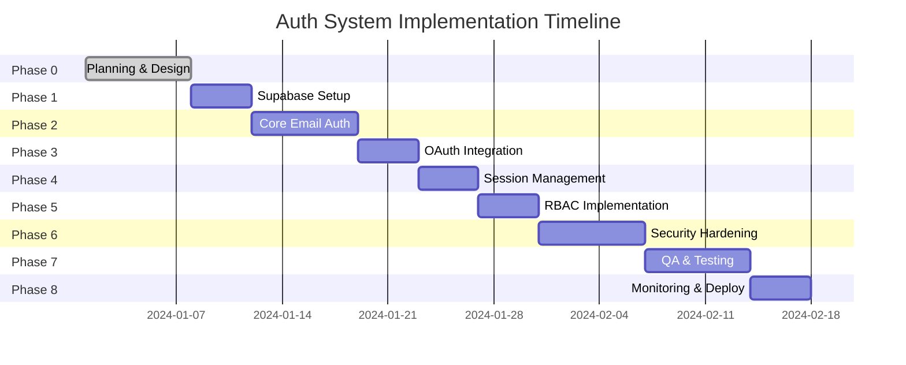

# Authentication System - Implementation Roadmap

## Overview

This document provides the detailed implementation roadmap for the unified Supabase authentication system, breaking down each phase into specific, actionable tasks with clear deliverables and acceptance criteria.

## Phase 0: Planning & Design ✅ COMPLETE

**Duration**: 1 week  
**Owner**: Product + Engineering  
**Status**: COMPLETE

### Deliverables ✅
- [x] **ERD Document** (`docs/auth-system-erd.md`)
- [x] **User Flow Diagrams** (`docs/auth-user-flows.md`)
- [x] **Technical Architecture** (`docs/auth-architecture.md`)
- [x] **Implementation Roadmap** (`docs/auth-implementation-roadmap.md`)

### Success Criteria ✅
- All stakeholders aligned on scope and approach
- Database schema finalized
- User flows validated
- Architecture approved by engineering team

---

## Phase 1: Supabase Project Setup

**Duration**: 0.5 week  
**Owner**: Backend Engineer  
**Dependencies**: Phase 0 complete

### Tasks

#### 1.1 Supabase Project Creation
- [ ] Create new Supabase project or verify existing
- [ ] Configure project settings and region
- [ ] Set up environment variables
- [ ] Verify database connection

#### 1.2 Database Schema Setup
- [ ] Create `migrations/` directory structure
- [ ] Implement migration scripts:
  - [ ] `001_initial_auth_setup.sql`
  - [ ] `002_profiles_table.sql` 
  - [ ] `003_audit_logging.sql`
  - [ ] `004_rls_policies.sql`
- [ ] Test migrations in development environment

#### 1.3 Row Level Security (RLS)
- [ ] Enable RLS on all custom tables
- [ ] Implement profile access policies
- [ ] Implement audit log policies
- [ ] Test RLS with different user roles

#### 1.4 Database Functions & Triggers
- [ ] Create `handle_new_user()` function
- [ ] Set up automatic profile creation trigger
- [ ] Create auth event logging functions
- [ ] Test all triggers with sample data

### Deliverables
- Supabase project ready for development
- Complete database schema implemented
- RLS policies active and tested
- Migration scripts in version control

### Acceptance Criteria
- [ ] Database migrations run successfully
- [ ] RLS policies enforce correct permissions
- [ ] Triggers create profiles automatically
- [ ] All auth events are logged

---

## Phase 2: Core Email Authentication

**Duration**: 1 week  
**Owner**: Frontend Engineer  
**Dependencies**: Phase 1 complete

### Tasks

#### 2.1 AuthService Foundation
- [ ] Create `lib/auth/authService.ts`
- [ ] Implement basic Supabase client wrapper
- [ ] Add error handling and logging
- [ ] Create TypeScript types

#### 2.2 AuthProvider Context
- [ ] Create `contexts/AuthProvider.tsx`
- [ ] Implement state management
- [ ] Add session initialization
- [ ] Handle auth state changes

#### 2.3 Core Auth Hooks
- [ ] Create `hooks/useAuth.ts`
- [ ] Create `hooks/useAuthGuard.ts`
- [ ] Add loading and error states
- [ ] Implement permission checking

#### 2.4 Email/Password Authentication
- [ ] Implement `signUp()` method
- [ ] Implement `signIn()` method
- [ ] Add form validation
- [ ] Handle confirmation emails

#### 2.5 Magic Link Authentication
- [ ] Implement `signInWithMagicLink()` method
- [ ] Create magic link request form
- [ ] Handle email delivery
- [ ] Test magic link flow

#### 2.6 Basic UI Components
- [ ] Create `components/auth/LoginForm.tsx`
- [ ] Create `components/auth/SignupForm.tsx`
- [ ] Add loading spinners and error displays
- [ ] Style with consistent design system

### Deliverables
- Working email/password authentication
- Magic link authentication functional
- Auth context providing global state
- Basic auth UI components

### Acceptance Criteria
- [ ] Users can sign up with email/password
- [ ] Email confirmation flow works
- [ ] Users can sign in with confirmed accounts
- [ ] Magic link authentication works
- [ ] Auth state persists across page refreshes
- [ ] Loading and error states display correctly

---

## Phase 3: Social OAuth Integration

**Duration**: 0.5 week  
**Owner**: Frontend Engineer  
**Dependencies**: Phase 2 complete

### Tasks

#### 3.1 OAuth Provider Configuration
- [ ] Configure Google OAuth in Supabase
- [ ] Set up OAuth redirect URLs
- [ ] Test OAuth credentials
- [ ] Document OAuth setup process

#### 3.2 Google OAuth Implementation
- [ ] Implement `signInWithGoogle()` method
- [ ] Create OAuth callback handler
- [ ] Handle OAuth errors and edge cases
- [ ] Test account linking scenarios

#### 3.3 OAuth UI Components
- [ ] Create `components/auth/GoogleSignin.tsx`
- [ ] Add Google branding and icons
- [ ] Integrate with existing auth forms
- [ ] Handle OAuth loading states

#### 3.4 Callback Route Handler
- [ ] Create `app/auth/callback/route.ts`
- [ ] Handle OAuth redirect processing
- [ ] Manage error scenarios
- [ ] Redirect to appropriate destinations

### Deliverables
- Google OAuth fully functional
- OAuth callback handling complete
- Branded OAuth UI components
- Error handling for OAuth flows

### Acceptance Criteria
- [ ] Users can sign in with Google
- [ ] OAuth redirects work correctly
- [ ] Account linking handles duplicates
- [ ] OAuth errors display user-friendly messages
- [ ] OAuth flow integrates with existing auth state

---

## Phase 4: Session Management

**Duration**: 0.5 week  
**Owner**: Frontend Engineer  
**Dependencies**: Phase 3 complete

### Tasks

#### 4.1 Session Persistence
- [ ] Implement session refresh logic
- [ ] Add automatic token refresh
- [ ] Handle session expiration
- [ ] Test session persistence across tabs

#### 4.2 Middleware Configuration
- [ ] Update `middleware.ts` for auth handling
- [ ] Add route protection logic
- [ ] Handle auth redirects
- [ ] Test middleware with all auth flows

#### 4.3 Session Recovery
- [ ] Implement session recovery on app load
- [ ] Handle invalid/expired sessions
- [ ] Add silent re-authentication
- [ ] Test edge cases and error scenarios

#### 4.4 Logout Functionality
- [ ] Implement `signOut()` method
- [ ] Clear all session data
- [ ] Handle logout from multiple tabs
- [ ] Test complete logout flow

### Deliverables
- Robust session management
- Automatic token refresh
- Secure logout functionality
- Middleware-based route protection

### Acceptance Criteria
- [ ] Sessions persist across browser sessions
- [ ] Tokens refresh automatically before expiry
- [ ] Logout clears all session data
- [ ] Protected routes redirect unauthorized users
- [ ] Session recovery works on app restart

---

## Phase 5: Role-Based Access Control

**Duration**: 0.5 week  
**Owner**: Backend Engineer  
**Dependencies**: Phase 4 complete

### Tasks

#### 5.1 Role Management System
- [ ] Implement role assignment triggers
- [ ] Create role update functions
- [ ] Add role validation logic
- [ ] Test role assignment flows

#### 5.2 Permission Framework
- [ ] Define permission matrix
- [ ] Implement `hasPermission()` logic
- [ ] Create permission checking hooks
- [ ] Add role-based UI components

#### 5.3 Admin Role Assignment
- [ ] Create admin assignment process
- [ ] Add role change audit logging
- [ ] Implement role change notifications
- [ ] Test admin permission scenarios

#### 5.4 Role-Based UI
- [ ] Create `usePermission()` hook
- [ ] Add conditional component rendering
- [ ] Implement admin-only sections
- [ ] Test all permission scenarios

### Deliverables
- Complete role-based access control
- Permission checking framework
- Admin role management
- Role-aware UI components

### Acceptance Criteria
- [ ] Users assigned correct default roles
- [ ] Admins can change user roles
- [ ] Role changes are audited
- [ ] UI adapts based on user permissions
- [ ] Permission checks work across all components

---

## Phase 6: Security Hardening

**Duration**: 1 week  
**Owner**: SecOps + Backend Engineer  
**Dependencies**: Phase 5 complete

### Tasks

#### 6.1 Multi-Factor Authentication (MFA)
- [ ] Enable TOTP MFA in Supabase
- [ ] Implement MFA enrollment flow
- [ ] Create MFA verification UI
- [ ] Enforce MFA for admin users

#### 6.2 Rate Limiting & Security
- [ ] Implement auth rate limiting
- [ ] Add IP-based restrictions
- [ ] Configure WAF rules
- [ ] Set up security monitoring

#### 6.3 Audit Logging Enhancement
- [ ] Enhance auth event logging
- [ ] Add IP address tracking
- [ ] Implement security alerts
- [ ] Create audit dashboard

#### 6.4 Security Testing
- [ ] Perform security vulnerability assessment
- [ ] Test rate limiting effectiveness
- [ ] Validate RLS policy enforcement
- [ ] Run penetration testing

### Deliverables
- MFA implementation for admin users
- Comprehensive security measures
- Enhanced audit logging
- Security testing results

### Acceptance Criteria
- [ ] MFA required for admin accounts
- [ ] Rate limiting prevents brute force attacks
- [ ] All auth events logged with full context
- [ ] Security vulnerabilities addressed
- [ ] Penetration testing passes

---

## Phase 7: Quality Assurance & Testing

**Duration**: 1 week  
**Owner**: QA Engineer + Frontend Engineer  
**Dependencies**: Phase 6 complete

### Tasks

#### 7.1 Automated Test Suite
- [ ] Create unit tests for auth components
- [ ] Write integration tests for auth flows
- [ ] Add end-to-end Cypress tests
- [ ] Set up test data management

#### 7.2 Performance Testing
- [ ] Load test auth endpoints
- [ ] Test concurrent user scenarios
- [ ] Measure auth flow performance
- [ ] Optimize bottlenecks

#### 7.3 Cross-Browser Testing
- [ ] Test in Chrome, Firefox, Safari, Edge
- [ ] Verify mobile browser compatibility
- [ ] Test OAuth flows across browsers
- [ ] Validate session persistence

#### 7.4 Error Handling Testing
- [ ] Test all error scenarios
- [ ] Verify error message clarity
- [ ] Test recovery mechanisms
- [ ] Validate fallback behaviors

### Deliverables
- Comprehensive test suite
- Performance benchmarks
- Cross-browser compatibility
- Error handling validation

### Acceptance Criteria
- [ ] 100% pass rate on automated tests
- [ ] P95 login latency < 300ms
- [ ] All browsers supported
- [ ] Error scenarios handled gracefully
- [ ] Load testing meets targets

---

## Phase 8: Monitoring & Deployment

**Duration**: 0.5 week  
**Owner**: DevOps Engineer  
**Dependencies**: Phase 7 complete

### Tasks

#### 8.1 Monitoring Setup
- [ ] Configure Supabase metrics
- [ ] Set up custom auth dashboards
- [ ] Add alerting for auth failures
- [ ] Monitor performance metrics

#### 8.2 Production Deployment
- [ ] Deploy to staging environment
- [ ] Run final testing in staging
- [ ] Deploy to production
- [ ] Monitor initial production traffic

#### 8.3 Documentation
- [ ] Update developer documentation
- [ ] Create user guides
- [ ] Document troubleshooting procedures
- [ ] Update security documentation

#### 8.4 Rollout Strategy
- [ ] Plan phased rollout approach
- [ ] Set up feature flags if needed
- [ ] Monitor user adoption
- [ ] Collect feedback and iterate

### Deliverables
- Production monitoring dashboards
- Complete documentation
- Successful production deployment
- User feedback collection

### Acceptance Criteria
- [ ] Monitoring shows healthy metrics
- [ ] Production deployment successful
- [ ] Documentation complete and accurate
- [ ] User feedback positive
- [ ] No critical issues in production

---

## Project Timeline

## Risk Management

### High-Risk Items
1. **OAuth Provider Changes**: Google may change OAuth requirements
   - *Mitigation*: Monitor provider documentation, implement flexible OAuth handling

2. **Session Security**: Token compromise or session hijacking
   - *Mitigation*: Implement strong security measures, monitor for suspicious activity

3. **Database Performance**: Auth queries impacting performance
   - *Mitigation*: Implement proper indexing, monitor query performance

### Medium-Risk Items
1. **User Experience**: Complex auth flows confusing users
   - *Mitigation*: User testing, clear error messages, progressive enhancement

2. **Integration Issues**: Problems with existing LEARN-X apps
   - *Mitigation*: Thorough testing, gradual rollout, rollback plans

## Success Metrics

### Technical Metrics
- **Performance**: P95 login latency < 300ms
- **Reliability**: 99.9% auth service uptime
- **Security**: 0 critical security vulnerabilities
- **Code Quality**: >90% test coverage

### Business Metrics
- **User Experience**: >95% sign-up completion rate
- **Developer Experience**: <2 hours integration time for new apps
- **Maintenance**: <4 hours/month auth-related maintenance
- **Incidents**: 0 P1 auth-related bugs post-launch

---

**Document Version**: v1.0  
**Phase**: 0 - Planning & Design  
**Last Updated**: Phase 0 - Implementation Planning  
**Next Phase**: Phase 1 - Supabase Project Setup