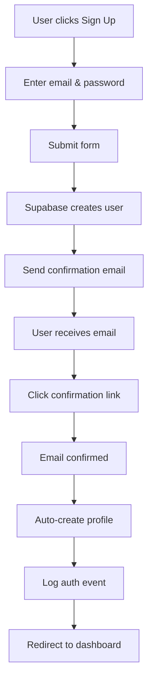
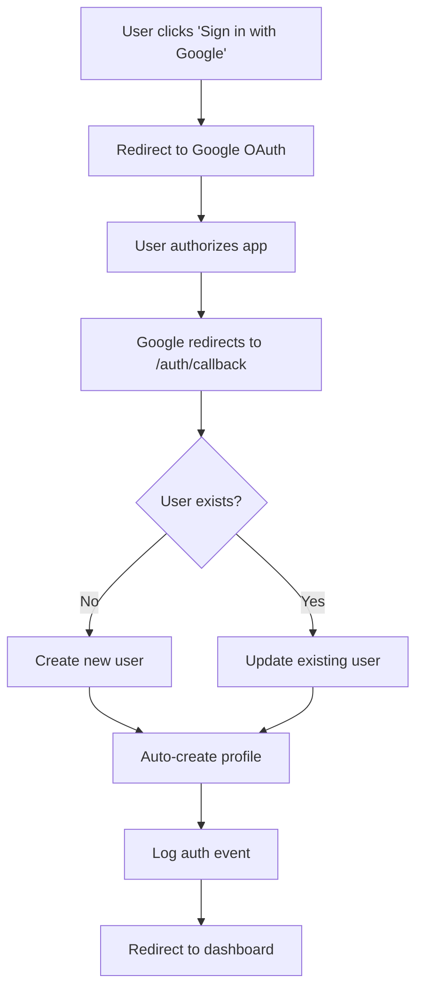
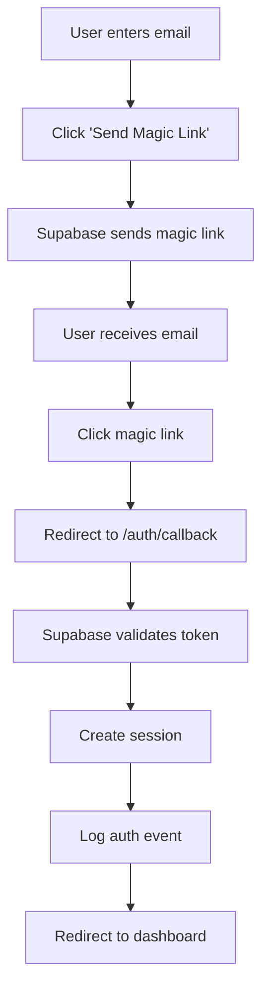
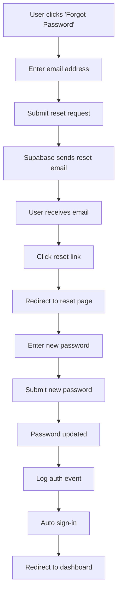
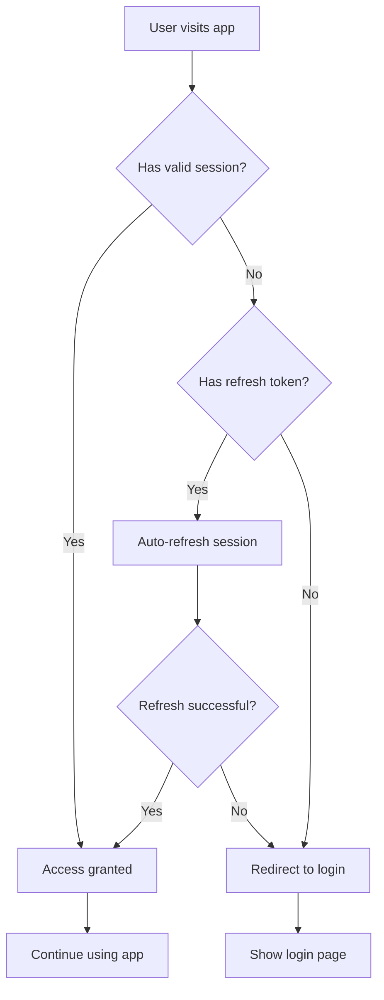
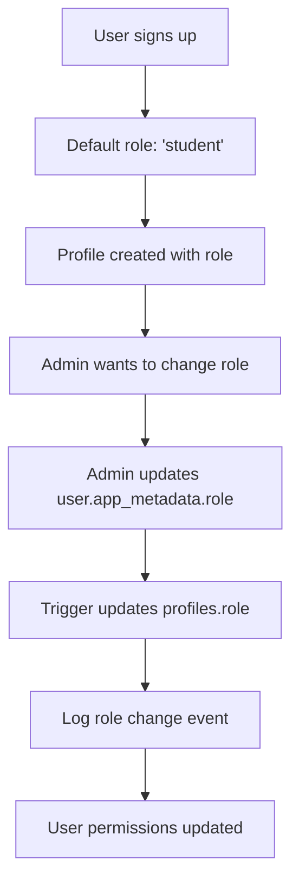
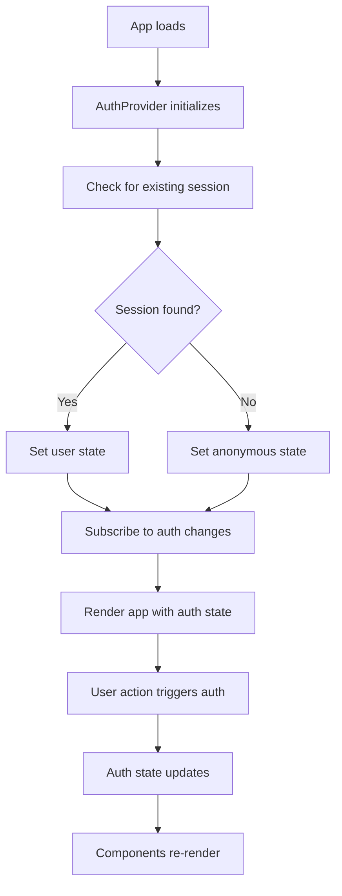
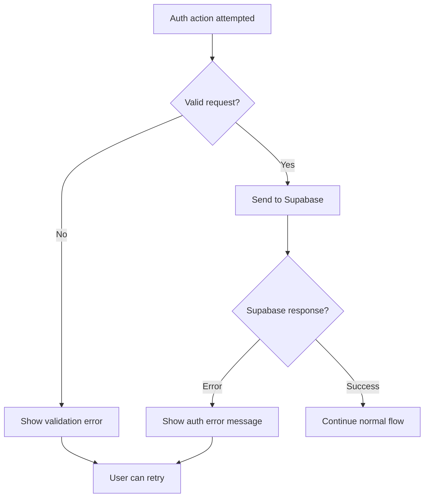
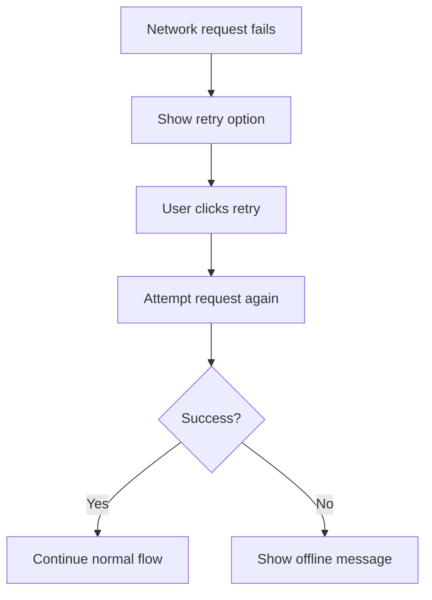

# Authentication System - User Flow Diagrams

## Overview

This document outlines all user flows for the unified Supabase authentication system, covering sign-up, sign-in, password reset, and social authentication.

## 1. Email + Password Sign-Up Flow

**Key Steps:**
1. User fills sign-up form with email/password
2. Supabase creates user in `auth.users` (unconfirmed)
3. Confirmation email sent automatically
4. User clicks email link → email confirmed
5. Database trigger creates `public.profiles` record
6. Auth event logged to `security.auth_events`
7. User redirected to dashboard

## 2. Google OAuth Sign-Up/Sign-In Flow

**Key Steps:**
1. User clicks Google sign-in button
2. Redirect to Google OAuth consent screen
3. User grants permissions
4. Google redirects to `/auth/callback?code=...`
5. Supabase exchanges code for user data
6. If new user: create profile, if existing: update session
7. Log authentication event
8. Redirect to dashboard

## 3. Magic Link Sign-In Flow

**Key Steps:**
1. User enters email address only
2. Supabase sends magic link to email
3. User clicks link in email
4. Token validated and session created
5. Auth event logged
6. Redirect to intended destination

## 4. Password Reset Flow

**Key Steps:**
1. User requests password reset
2. Reset email sent with secure token
3. User clicks reset link
4. Redirected to password reset form
5. New password submitted and updated
6. User automatically signed in
7. Event logged and redirected

## 5. Session Management Flow

**Key Steps:**
1. Every request checks for valid session
2. If session expired, attempt refresh
3. If refresh fails, redirect to login
4. If refresh succeeds, continue with request

## 6. Role Assignment Flow

**Role Assignment Rules:**
- **Default**: All new users get `student` role
- **Instructor**: Must be manually assigned by admin
- **Admin**: Must be manually assigned by existing admin
- **Changes**: Logged in `auth_events` for audit trail

## 7. Authentication Context Flow

## 8. Error Handling Flows

### Authentication Errors

### Network Errors

## 9. Security Flow Checkpoints

### Session Validation
1. **Client-side**: Check session on route changes
2. **Server-side**: Validate session on API requests
3. **Middleware**: Refresh tokens automatically
4. **RLS**: Database-level permission checks

### Audit Logging Points
1. **Sign up**: New user creation
2. **Sign in**: Successful authentication
3. **Sign out**: Session termination
4. **Password reset**: Security-sensitive action
5. **Role changes**: Permission modifications
6. **Failed attempts**: Security monitoring

## 10. Integration Points

### Frontend Components
- **AuthProvider**: Manages global auth state
- **useAuth Hook**: Provides auth methods to components
- **AuthGuard**: Protects routes requiring authentication
- **Login/Signup Forms**: User interface components

### Backend Integration
- **Middleware**: Handles auth state in Next.js
- **API Routes**: Server-side authentication checks
- **Database Triggers**: Automatic profile creation
- **Webhooks**: External system notifications

## Implementation Priority

### Phase 1: Core Auth (Week 1)
1. ✅ Email/password authentication
2. ✅ Magic link authentication  
3. ✅ Basic session management
4. ✅ Profile creation trigger

### Phase 2: Social Auth (Week 2)
1. ✅ Google OAuth integration
2. ✅ Callback handling
3. ✅ Account linking

### Phase 3: Security & RBAC (Week 3)
1. ✅ Role-based access control
2. ✅ Audit logging
3. ✅ MFA for admins

### Phase 4: Polish & Monitoring (Week 4)
1. ✅ Error handling refinement
2. ✅ Performance optimization
3. ✅ Monitoring dashboards

---

**Document Version**: v1.0  
**Phase**: 0 - Planning & Design  
**Last Updated**: Phase 0 - User Flow Definition