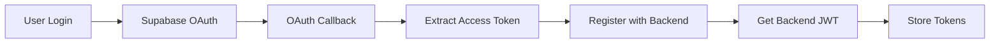

# Firebase to Supabase Migration Guide

## Overview

This document outlines the complete migration from Firebase authentication to Supabase authentication for the LINK-X project.

## 🔄 Migration Summary

### What Changed
- **Authentication Provider**: Firebase → Supabase
- **Token Format**: Firebase JWT → Supabase JWT
- **Auth Headers**: `X-Firebase-Token` → `Authorization: Bearer`
- **Client Management**: Multiple Firebase clients → Single Supabase client
- **OAuth Flow**: Firebase OAuth → Supabase OAuth

### Files Modified

#### 1. Environment Configuration
- **File**: `frontend/.env.local`
- **Change**: Removed Firebase config, kept Supabase config
- **Result**: Single source of truth for Supabase credentials

#### 2. Core Configuration Files
- **File**: `frontend/firebaseconfig.ts`
- **Change**: Replaced Firebase config with Supabase compatibility layer
- **Result**: Backward-compatible exports for existing components

#### 3. Authentication Service Layer
- **File**: `frontend/lib/auth-service.ts`
- **Change**: Replaced `FirebaseManager` with `SupabaseManager`
- **Result**: Unified Supabase authentication flow

#### 4. Manager Classes
- **File**: `frontend/lib/auth/supabase-manager.ts` (NEW)
- **Change**: Created Supabase equivalent of Firebase manager
- **Features**:
  - Session management
  - Token extraction
  - OAuth handling
  - User state management

- **File**: `frontend/lib/auth/firebase-manager.ts` (DELETED)
- **Reason**: No longer needed after Supabase migration

#### 5. Registration Manager
- **File**: `frontend/lib/auth/registration-manager.ts`
- **Changes**:
  - Updated imports: `FirebaseUser` → `SupabaseUser`
  - Updated method signatures to use Supabase types
  - Updated token extraction logic
  - Updated header format for backend communication

#### 6. API Client Layer
- **File**: `frontend/lib/api/clients/auth-client.ts`
- **Changes**:
  - Removed Firebase auth fallback
  - Updated to use Supabase session management
  - Changed auth headers to use `Authorization: Bearer`

- **File**: `frontend/lib/api/clients/streaming-client.ts`
- **Changes**:
  - Updated auth headers for streaming requests
  - Aligned with Supabase token format

#### 7. API Endpoints
- **File**: `frontend/lib/api/endpoints/auth.ts`
- **Changes**:
  - Removed Firebase `getIdToken()` calls
  - Added new Supabase-compatible functions
  - Updated auth headers to use Bearer tokens
  - Removed deprecated Firebase methods

#### 8. Client Singleton Management
- **File**: `frontend/lib/supabase.ts`
- **Change**: Now re-exports singleton from `supabaseconfig.ts`

- **File**: `frontend/lib/auth/supabase-client.ts`
- **Change**: Now re-exports singleton with helper functions

#### 9. OAuth Callback Handling
- **File**: `frontend/app/auth/callback/page.tsx`
- **Change**: Enhanced to handle both PKCE and implicit OAuth flows
- **Result**: Proper URL parameter parsing for Supabase

## 🔧 Technical Changes

### Authentication Flow

### Token Hierarchy
1. **Supabase Access Token** - Primary authentication
2. **Backend JWT** - API access (when available)
3. **Session Storage** - Persistent authentication state

### Header Changes
- **Before**: `X-Firebase-Token: <firebase_jwt>`
- **After**: `Authorization: Bearer <supabase_jwt>`

## 🚀 Benefits

### 1. Simplified Client Management
- Single Supabase client instance prevents conflicts
- No more "Multiple GoTrueClient instances" warnings
- Consistent authentication state across components

### 2. Better OAuth Handling
- Supports both PKCE and implicit flows
- Proper URL parameter parsing
- Enhanced error handling and retry logic

### 3. Unified Backend Integration
- Consistent token format for backend communication
- Proper Bearer token authentication
- Streamlined API client architecture

### 4. Enhanced Developer Experience
- Single configuration source
- Clear separation of concerns
- Better error messages and debugging

## 🔒 Security Improvements

### 1. PKCE Flow Support
- More secure OAuth flow
- Prevents authorization code interception
- Industry standard for SPA applications

### 2. Token Management
- Proper token expiration handling
- Automatic session refresh
- Secure storage practices

### 3. Error Handling
- Graceful fallback mechanisms
- Proper error propagation
- User-friendly error messages

## 🧪 Testing Considerations

### 1. Authentication Flow Testing
- Test OAuth redirect handling
- Verify token extraction and storage
- Confirm backend registration flow

### 2. API Integration Testing
- Verify all endpoints use correct headers
- Test token refresh mechanisms
- Confirm fallback behaviors

### 3. Edge Cases
- Test expired token scenarios
- Verify network failure handling
- Test concurrent authentication attempts

## 📝 Remaining Considerations

### Backend Compatibility
The backend needs to support Supabase JWT validation for the `/api/v2/auth/me` endpoint. Currently it expects Firebase tokens via `@firebase_auth_required` decorator.

**Recommended Solution**:
Update the backend endpoint to use `@supabase_auth_required` decorator or modify the existing auth middleware to support both token types during transition.

### Monitoring and Logging
- Monitor authentication success rates
- Track token refresh patterns
- Log any migration-related errors

## 🎯 Next Steps

1. **Backend Integration**: Update backend to support Supabase JWT validation
2. **Testing**: Comprehensive testing of the new authentication flow
3. **Monitoring**: Set up monitoring for authentication metrics
4. **Documentation**: Update API documentation to reflect new token format
5. **Cleanup**: Remove any remaining Firebase dependencies

## 📞 Support

For issues or questions about this migration:
1. Check the authentication flow in the browser developer tools
2. Verify Supabase configuration in `.env.local`
3. Check console logs for detailed error messages
4. Refer to Supabase documentation for OAuth configuration 